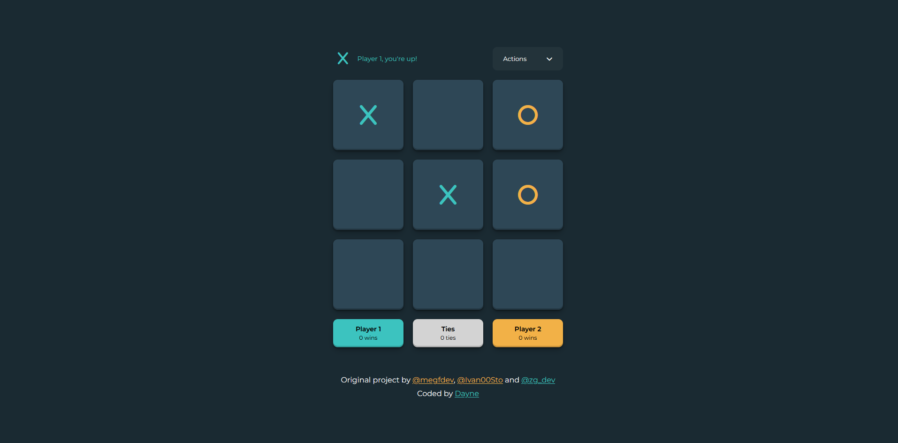

#  TicTacToe Game

This is a React refactor of a TicTacToe game made with HTML, CSS and JS. The users are able to play a game taking turns. The score board keeps track of wins and losses by either player as well as ties. The game can be played from
multiple tabs, and the match will persist through tab refreshes. 

## Table of contents

- [Overview](#overview)
  - [Screenshot](#screenshot)
  - [Links](#links)
- [My process](#my-process)
  - [Built with](#built-with)
  - [What I learned](#what-i-learned)
  - [Continued development](#continued-development)
  - [References](#references)
- [Author](#author)

## Overview

### Screenshot
|  
| ------------------------------ |
| Design Preview                |

### Links

- GitHub Profile: [GitHub URL](https://github.com/Dayne2x)
- Live Site URL: [GitHub Pages Live URL](https://dayne2x.github.io/HTML5-Video-Player/)

## My process

### Built with:

  
  
  

### What I learned

This project introduced me to a lot of advanced concepts, and I've learned a lot about the MVC pattern, Local Storage, using the terminal to install various developer dependecies  and have also been working on refactoring this project using TypeScript as well as React.
You can find these refactors as different branches of this repository. 

### Continued development

The next steps will include study of frameworks and typescript.

### References and Acknowledgements

Zach Gollwitzer's tutorial  
[Frontend Web Development: In-Depth Project Tutorial](https://www.youtube.com/watch?v=MsnQ5uepIaE)

## Author
You can find me at:

- Frontend Mentor - [@Dayne2x](https://www.frontendmentor.io/profile/Dayne2x)
- GitHub - [Dayne2x](https://github.com/Dayne2x)
- LinkedIn - [Nemanja](https://www.linkedin.com/in/nemanjadayne/)
